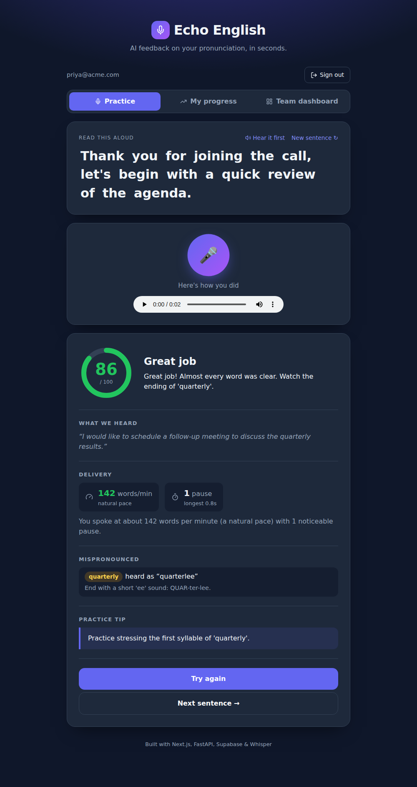
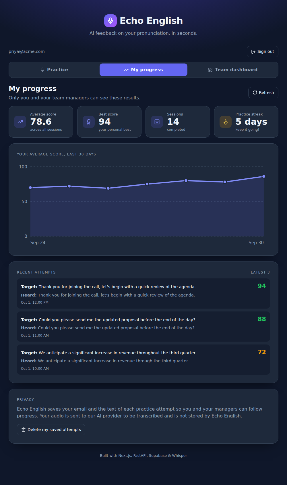
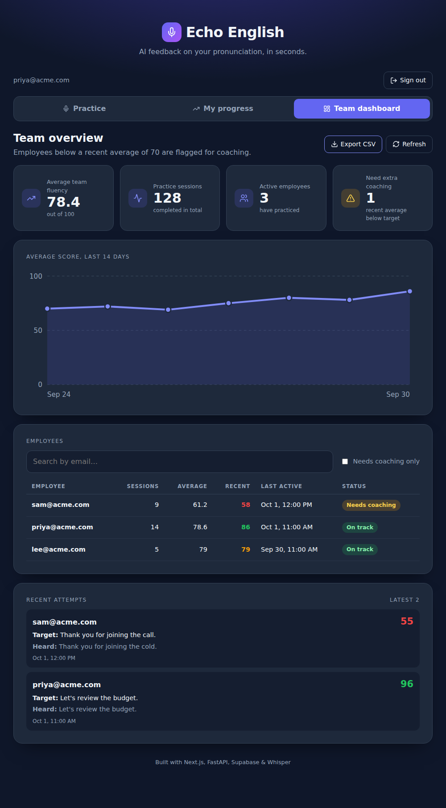
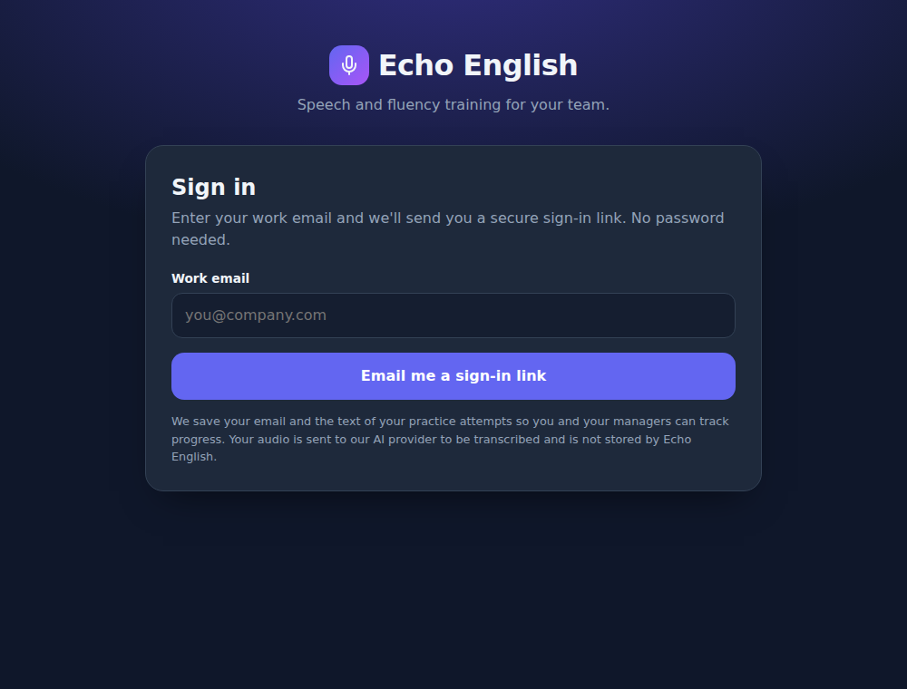

# 🎙️ Echo English

**AI-powered English pronunciation and fluency training for teams.** Employees sign in, read corporate phrases aloud, and get instant AI feedback with a score out of 100. Managers get a dashboard with team averages, practice volume, trends and a list of who needs extra coaching.

## Screenshots

*Screenshots use sample data.*

| Practice with feedback | My progress |
| --- | --- |
|  |  |

| Manager dashboard | Sign in |
| --- | --- |
|  |  |

## Features

**For employees**
- Passwordless sign-in with a magic link (Supabase Auth)
- Corporate practice phrases, in-browser recording (MediaRecorder API) and instant feedback
- Score ring, missed and mispronounced words highlighted in the sentence, and a practice tip
- **Fluency metrics:** speaking pace (words per minute) and pause detection from Whisper word timestamps
- **"Hear it first":** the browser reads the target sentence aloud (Web Speech API)
- **My progress:** personal average, best score, practice streak, 30-day trend and attempt history
- **Privacy controls:** one-click deletion of your own saved attempts; audio is never stored by the app
- Noise-aware scoring: noisy recordings are flagged instead of unfairly penalised

**For managers**
- Average team fluency score, total sessions and active employees
- 14-day team trend chart
- Per-employee table with a **"Needs coaching"** flag (recent average below 70)
- History of recent attempts (what was expected vs. what was heard)
- **CSV export** of attempts (with spreadsheet-formula injection protection)

## Architecture

```
Browser (Next.js)  ──Bearer token──▶  FastAPI on Vercel  ──▶  Whisper + LLM (Groq or OpenAI)
      │                                      │
      └── Supabase Auth (login)              └── Supabase Postgres (scores table, service role)
```

1. The browser signs the user in with **Supabase Auth** and records audio.
2. It posts the audio to `POST /api/analyze` with the user's access token.
3. The backend **verifies the token with Supabase** and uses the verified email (never a client-supplied one).
4. Whisper transcribes the audio, an LLM scores it, and the result is saved to the `scores` table.
5. Managers call `GET /api/dashboard`, which is restricted to the emails in `MANAGER_EMAILS`.

### Security design
- The Supabase **service-role key lives only on the server**. The browser only gets the public anon key.
- The `scores` table has **Row Level Security enabled with no policies**, so the anon key cannot read or write it. All data access goes through the backend.
- Submitting a recording for someone else's email is rejected (`403`).
- Dashboard access is checked server-side; hiding the tab in the UI is only a convenience.
- Noisy (low-confidence) attempts are not stored, so background noise can't wrongly flag an employee for coaching.
- Users can only read or delete **their own** rows; the email always comes from the verified token.
- A per-user rate limit (10 analyses per 5 minutes) protects the free AI quota. It is best-effort per serverless instance, not a global guarantee.
- CSV exports prefix cells starting with `=`, `+`, `-` or `@` so they can't run as spreadsheet formulas.

## Tech stack

| Layer | Technology |
| --- | --- |
| Frontend | Next.js (App Router), React, Lucide icons, plain CSS, hand-built SVG chart |
| Backend | Python, FastAPI, Pydantic |
| Auth & database | Supabase (Auth + Postgres) via `supabase-py` and `@supabase/supabase-js` |
| AI | OpenAI Python SDK pointed at Groq (free) or OpenAI: Whisper + an LLM |
| Hosting | Vercel (Next.js + Python Serverless Functions) |

## Project structure

```
echo-english/
├── api/
│   └── index.py          # FastAPI backend: auth, analysis, Supabase reads/writes
├── src/app/
│   ├── page.js           # Login, practice UI, fluency card, tabs
│   ├── progress.js       # "My progress" tab and privacy controls
│   ├── dashboard.js      # Manager dashboard
│   ├── shared.js         # Shared stat cards, SVG trend chart, formatters
│   ├── layout.js         # Root layout and metadata
│   └── globals.css       # Styles
├── supabase/
│   └── schema.sql        # Table + indexes + Row Level Security
├── tests/                # pytest suite (AI and Supabase are mocked)
├── .github/workflows/    # CI: backend tests + frontend build
├── docs/screenshots/     # README images
├── requirements.txt
├── requirements-dev.txt  # + pytest
├── package.json
└── vercel.json           # Routes /api/* to the Python function
```

## Setup

### 1. Supabase
1. Create a free project at [supabase.com](https://supabase.com).
2. Open **SQL Editor**, paste the contents of `supabase/schema.sql` and run it.
3. Go to **Authentication → URL Configuration** and set **Site URL** to your deployed URL (e.g. `https://echoenglish.vercel.app`). Add `http://localhost:3000` to **Redirect URLs** for local testing.
4. From **Project Settings → API**, copy the **Project URL**, the **anon public** key and the **service_role** key.

> **Note:** Supabase's built-in email sender is heavily rate-limited on the free tier (a few emails per hour). That is fine for a demo; for real use, add a custom SMTP provider under **Authentication → SMTP Settings**.

### 2. Environment variables

Set these in Vercel under **Settings → Environment Variables** (or in a local `.env`):

| Variable | Used by | Description |
| --- | --- | --- |
| `GROQ_API_KEY` | backend | Free AI provider key (or use `OPENAI_API_KEY`) |
| `SUPABASE_URL` | backend | Supabase project URL |
| `SUPABASE_SERVICE_ROLE_KEY` | backend | **Secret.** Server only. Never expose it |
| `MANAGER_EMAILS` | backend | Comma-separated emails allowed to see the dashboard |
| `NEXT_PUBLIC_SUPABASE_URL` | browser | Same project URL |
| `NEXT_PUBLIC_SUPABASE_ANON_KEY` | browser | Public anon key |
| `ALLOWED_ORIGINS` | backend (optional) | Comma-separated CORS origins; defaults to `*` |

`NEXT_PUBLIC_*` variables are baked in at build time, so **redeploy after adding them**.

### 3. Run locally

Prerequisites: Node.js 18+, Python 3.11+, the [Vercel CLI](https://vercel.com/docs/cli).

```bash
npm install
vercel dev      # runs Next.js and the Python API together
```

Open http://localhost:3000. Microphone access requires `localhost` or HTTPS.

## Tests

```bash
pip install -r requirements-dev.txt
pytest
```

The suite mocks the AI provider and Supabase, and covers authentication, spoofing and manager-only access, saving and failure handling, fluency calculations, dashboard and history analytics, CSV safety, deletion and rate limiting. GitHub Actions runs it (plus a production frontend build) on every push.

## API

All routes except `/api/health` need `Authorization: Bearer <supabase access token>`.

| Route | Access | Description |
| --- | --- | --- |
| `GET /api/health` | public | Liveness probe |
| `GET /api/me` | signed in | Verified email and `is_manager` flag |
| `POST /api/analyze` | signed in | Multipart: `audio`, `expected_text`, optional `user_email` (must match the token). Returns score, feedback, tip, transcript, `fluency`, `saved` |
| `GET /api/history` | signed in | Your own stats, streak, 30-day trend and recent attempts |
| `DELETE /api/history` | signed in | Delete your own saved attempts |
| `GET /api/dashboard` | managers | Team metrics, trend, per-employee summaries, recent attempts |
| `GET /api/dashboard/export` | managers | CSV download of recent attempts |

## Design notes

- **Whisper is not primed with the target sentence**, which would bias it toward "correcting" mistakes and hide the errors the app exists to catch.
- **Upload limits:** Vercel rejects request bodies over about 4.5 MB, so recordings are capped at 30 seconds and 4 MB.
- **Graceful failures:** if saving to the database fails, the employee still gets their feedback and a notice.
- **Dashboard scale:** analytics are computed from the newest 5,000 sessions; the UI says so when older history is excluded.
- **Cross-browser audio:** the recorder picks webm or mp4 based on browser support, so Safari works too.

## Possible next steps

- Multiple teams / companies with per-team manager access
- Manager-defined custom phrase sets
- Phoneme-level feedback and a stronger noise-reduction step (e.g. RNNoise in the browser)
